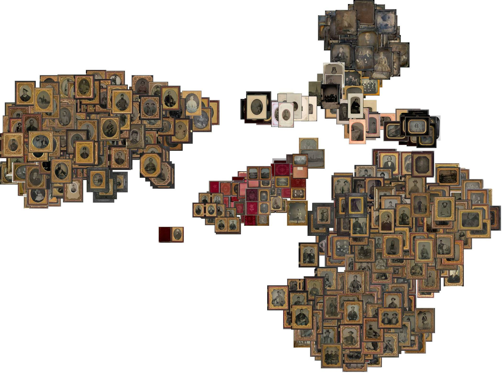

## 🤖 Inteligencia artificial y fotografía

Desde hace años, en mis tiempos libres, he estado aprendiendo y experimentando con las tecnicas de inteligencia artificial (IA) para aplicarlas a las tareas de la conservación y los archivos. Una primera hipótesis es que estas herramientas pueden servir para apoyar la identificación del proceso fotográfico (técnica de elaboración) en fotografías históricas.

<!--more-->

## 🔗 Resultado

Mi primer resultado lo he compartido en un repositorio de Github que contiene el cuaderno de Jupyter, el conjunto de datos y la lista de paquetes necesarios. Lo puedes encontrar aqui [https://github.com/gustavolsj/image-recognition](https://github.com/gustavolsj/image-recognition)

## 🤔 Justificación

A lo largo de la historía la fotografía ha evolucionado materialmente pasando de soportes rigidos y pesados como el vidrio y el metal a soportes ligeros y flexibles como los plásticos y el papel; las tomas que antes tomaban varios segundos después se podían hacer en una fracción de segundo y finalmente las fotografías que originalmente solo podían ser monocromas, después pudieron registrar y mostrar todos los colores de la naturaleza.

Cada uno de estos avances le da a los objetos fotográficos características físicas unicas que en un archivo es importante reconocer ya que nos ayudan a conocer su contexto histórico, saber de qué manera se deben conservar y poder describirlas correctamente.

La forma más sencilla de aplicar la IA a esta tarea es proporcionando un conjunto heterogeneo de imagenes para ver de qué manera las organiza o clasifica, ya que estas herramientas no han sido entrenadas para esta tarea no es posible que lo hagan mediante categorias concretas pero se puede hacer de manera comparativa y obtener el resultado de manera visual.

El resultado es una imagen como la que se muestra arriba, en la que 250 fotografías de cuatro técnicas diferentes son agrupadas por sus principales rasgos visuales, pero que no coinciden con su técnica sino con su forma de presentación como el tipo de estuche o marco en el que se han colocado.

## ⚙️Funcionamiento

Para este experimento seguí los pasos de esta [guía](https://github.com/ml4a/ml4a/blob/master/examples/info_retrieval/image-tsne.ipynb)

Y escribí un artículo donde explicó con más detalle las motivaciones de este experimeto y los aspectos técnicos detras de él, lo puedes leer [aquí](https://www.academia.edu/92501941/Identificación_de_procesos_fotográficos_mediante_técnicas_de_aprendizaje_de_máquina)
