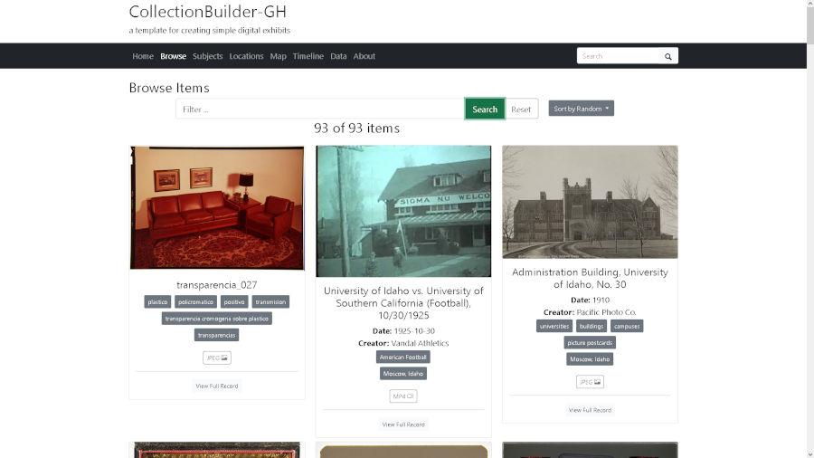

## Mi segundo blog

- [Datalogger para conservación](https://github.com/gustavolsj/datalogger-conservacion)

<!--more-->

Estoy siguiendo está [guía](https://www.smashingmagazine.com/2014/08/build-blog-jekyll-github-pages/) que les recomiendo mucho.

Ahora mismo escribo dentro de VS code en lenguaje markdown, es algo relativamente nuevo para mi, porque también lo he usado en los cuadernos de Jupyter y en los archivos Readme.md de los repositorios que tengo en Github

Algo muy similar que también he exlporado ultimamente es el uso de Jekyll + Github Pages para hospedar exposiciones digitales con [CollectionBuilder](https://collectionbuilder.github.io)

La Universidad de los Andes de Colombia y [The Programming Historian](https://twitter.com/ProgHist) organizaron hace unos días un taller sobre creación de exposiciones digitales con esta herramienta y me ha fascinado. Permite visualizar las fotos en un mapa, en una linea de tiempo, en una nube de palabras y ampliar las fotos en un visor integrado.

Este es un [demo](https://gustavolsj.github.io/test2_collection_builder/) que estoy probando en otro repositorio y hasta el momento he subido varias fotos con algunos metadatos.

Seguimos,
