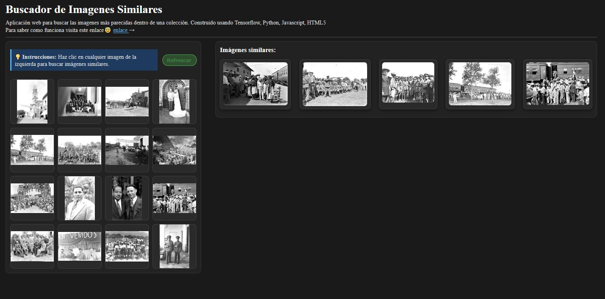

## Busqueda visual de fotografias

Esta aplicación fue uno de mis primeros intentos para facilitar la exploración de colecciones fotográficas a partir del contenido visual de las imágenes y no solo desde sus metadatos. La idea principal es que una imagen de referencia permita encontrar otras que sean parecidas por su forma, contraste o composición general.

<!--more-->

## Resultado

Puedes probar la aplicación aquí [https://gustavolsj.github.io/web_buscador_img/](https://gustavolsj.github.io/web_buscador_img/)

## Funcionamiento

El buscador compara vectores de características extraídos automáticamente de las imágenes. Con esa comparación calcula una medida de semejanza y devuelve un conjunto de resultados cercanos. En la práctica esto ayuda a ubicar fotos relacionadas entre sí cuando no hay una descripción textual suficiente o cuando los metadatos son incompletos.

Este tipo de herramienta puede ser útil para tareas de organización inicial, revisión de conjuntos grandes y apoyo en procesos de identificación dentro de archivos fotográficos.

## Links cruzados

- [Ver todas las aplicaciones](/aplicaciones/)
- [Clasificador de imagenes]()
- [Teachable Machine para clasificar imagenes]()
