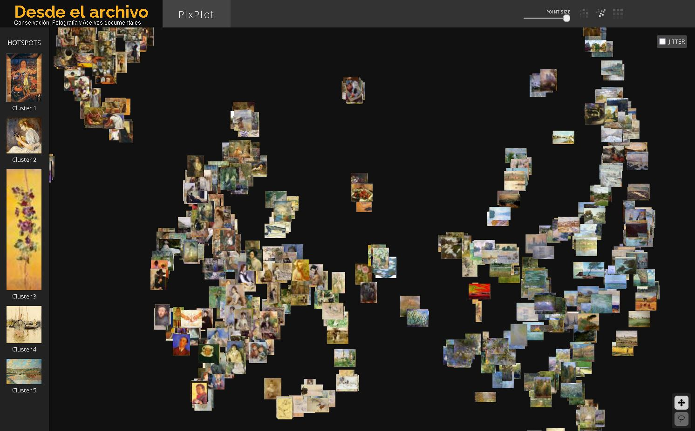

## Pixplot

Uno de las primeros experimentos con Inteligencia artificial y fotografía que pude replicar fue Pixplot, un desarrollo del programador Douglas Duhaime del Yale Digital Humanities Lab, que es muy fácil de utilizar para principiantes como yo.

<!--more-->

En este caso utilicé una porción del conjunto de datos Wikiart, que contiene pinturas impresionistas como Monet y Morisot, pero tambien murales de Diego Rivera.

El resultado lo puedes ver [aqui](https://gustavolsj.github.io/pixplot_wikiart/#).

## Funcionamiento

Pixplot utiliza la red neuronal convolucional Inception para analizar y extraer las caracteristicas escenciales de cada imagen. Estas caracteristicas son vectores numericos que permiten comparar dos imagenes y de esa manera identificar cuales son más parecidas entre sí.De esa manera las imagenes se pueden colocar en un espacio bidimensional en el que la distancia es indicativa de la semejanza visual. Para conocer más sobre este proyecto puedes leer sobre él [aquí](https://dhlab.yale.edu/projects/pixplot/)

## Interacción

Este último aspecto me parece interesante desde el punto de vista de la interacción del usuario con las imagenes ya que normalmente interactuamos con ellas en forma de listados, reticulas, o galerias. Es decir de una manera secuencial y regular que indica el acomod por nombre de archivo, tamaño, fecha o alguna otra caracteristica relacionada con los metadatos técnicos del archivo o descriptivos de la imagen.

Sin embargo en Pixplot todo el procesamiento se basa unicamente en el contenido visual de la imagen y no en sus metadatos, por ello me aprece acertado que para indicarlo se proponga un modo de acomodo e interacción que indique esa caracteristica de la aplicación y de los datos. Esto es muy diferente a la propuesta Distant Viewing de la que hablaré en otra ocasión.

El acomodo que hace divide las imagenes en 5 conjunbtos en total, pero son dos los principales y efectivamente las imagenes que contiene cada uno de ellos guardan una coherencia visual entre sí y son muy diferentes a las del otro conjunto.
