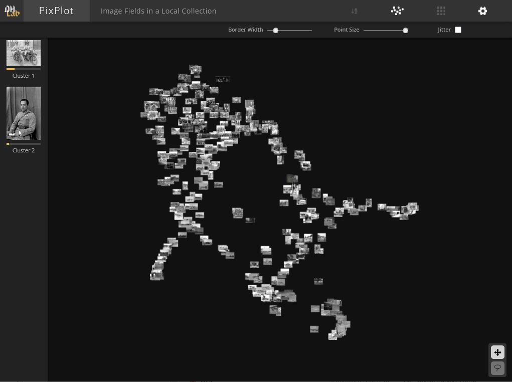

## PixPlot sobre fotografías de VCS

Después de trabajar con el conjunto de Wikiart, hice una versión de PixPlot para explorar fotografías del fondo VCS. El objetivo fue usar un conjunto de datos más cercano a lo que me interesa en torno a archivos fotográficos

<!--more-->

## Resultado

La visualización se puede consultar aquí [https://gustavolsj.github.io/pixplot_vcs/](https://gustavolsj.github.io/pixplot_vcs/)

## Funcionamiento

PixPlot proyecta las imágenes en un espacio bidimensional según su semejanza visual. De esta forma se forman zonas de mayor afinidad en las que aparecen patrones de color, textura o composición que no siempre son evidentes en una navegación tradicional por carpetas o listados.

Para trabajo exploratorio en archivos fotográficos, esta vista permite detectar agrupaciones rápidamente y formular nuevas hipótesis de análisis sobre el conjunto.

## Links cruzados

- [Ver todas las aplicaciones](/aplicaciones/)
- [Visualización de semejanzas (PixPlot Wikiart)]()
- [Collection Space Navigator (CSN)]()
