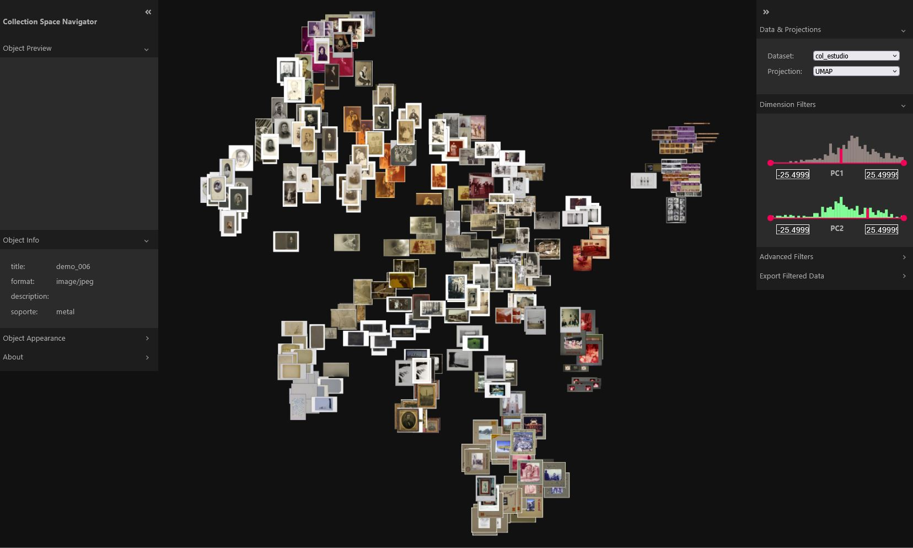

## Navegación de colecciones con Collection Space Navigator (CSN)

CSN es otra aplicación web para explorar colecciones de imágenes mediante el análisis de su proximidad visual. Es muy parecido a [PixPlot](https://gustavolsj.github.io/Pixplot/) pero con una interfaz de navegación más completa, que permite explorar diversos datasets en el mismo entorno y filtrar las imagenes usando metdatos numericos o etiquetas. También permite comparar embeddings de diferentes modelos de redes neuronales para ver cómo se organizan las imágenes de un mismo conjunto según diferentes representaciones. Para conocer más sobre este proyecto puedes leer sobre él [aquí](https://github.com/Collection-Space-Navigator/CSN)

<!--more-->

## Resultado

Puedes visitar la aplicación en [https://gustavolsj.github.io/CSN/](https://gustavolsj.github.io/CSN/)

## Funcionamiento

Collection Space Navigator construye una estructura de similitud entre imágenes y la presenta como un entorno navegable. En lugar de consultar únicamente por texto o filtros rígidos, el usuario puede desplazarse entre grupos visualmente cercanos y descubrir conexiones no previstas.

- [Ver todas las aplicaciones](/aplicaciones/)
