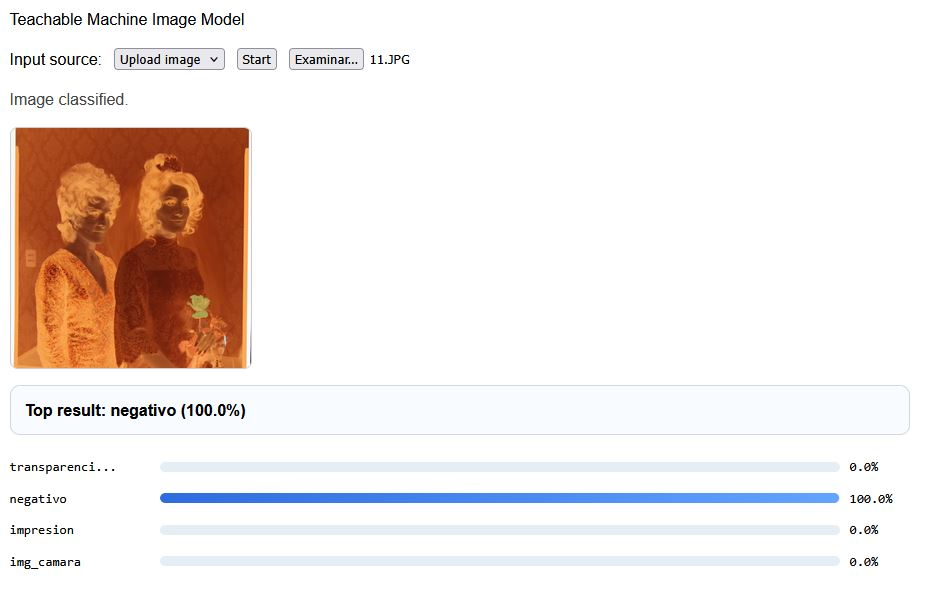

## Un clasificador sencillo con Teachable Machine

Con esta aplicación quise explorar una ruta más simple para poder entrenar modelos de IA para la clasificación de imágenes, esta vez usando Teachable Machine una herramienta on line sumamente accesible, que evita montar un espacio de trabajo complejo.

Este caso es el mismo que el del clasificador de tipologías fotograficas, y esta basado en un conjeunto de datos que recopilé.

<!--more-->

## Resultado

Puedes ver y probar el experimento aquí [https://gustavolsj.github.io/teachable_machine/](https://gustavolsj.github.io/teachable_machine/)

## Funcionamiento

Teachable Machine permite entrenar un modelo a partir de ejemplos cargados por el usuario y exportarlo para usarlo en tupropoa pagina en la web. En este caso el modelo clasifica imágenes en categorías definidas previamente y devuelve una probabilidad para cada una.

## Links cruzados

- [Ver todas las aplicaciones](/aplicaciones/)
- [Clasificador de imagenes]()
- [Buscador de imagenes similares]()
