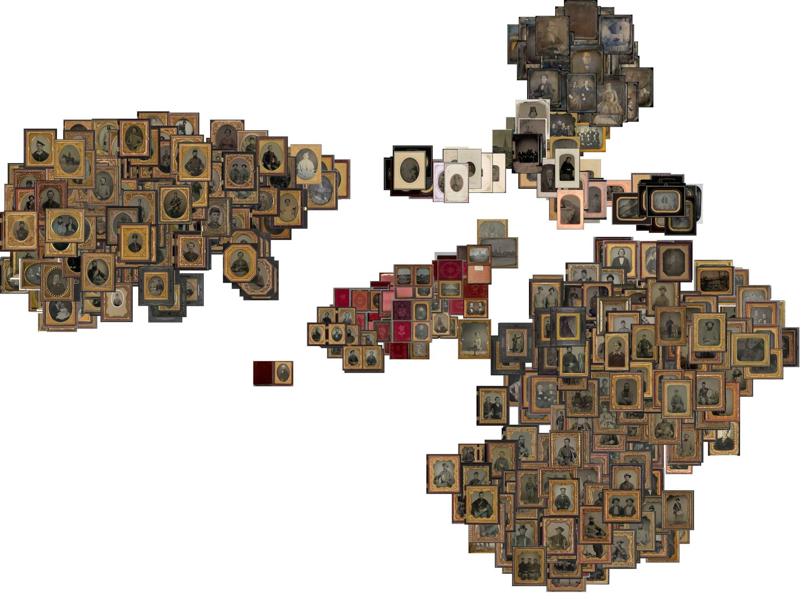

## Un clasificador sencillo con Teachable Machine

Con esta aplicación quise explorar una ruta más simple para entrenar modelos de clasificación de imágenes, usando Teachable Machine. Me interesaba comprobar hasta dónde se puede llegar con una herramienta accesible, sin montar de entrada un flujo técnico complejo.

En este caso es el mismo caso de tipologías fotograficas que usé para el clasificador anterior, pero con un modelo entrenado a partir de ejemplos cargados directamente en la plataforma en linea sin necesidad de instalar o configurar muchos parametros.

<!--more-->

## Resultado

Puedes ver y probar el experimento aquí [https://gustavolsj.github.io/teachable_machine/](https://gustavolsj.github.io/teachable_machine/)

## Funcionamiento

Teachable Machine permite entrenar un modelo a partir de ejemplos cargados por el usuario y exportarlo para usarlo en la web. En este caso el modelo clasifica imágenes en categorías definidas previamente y devuelve una probabilidad para cada una.

## Links cruzados

- [Ver todas las aplicaciones](/aplicaciones/)
- [Clasificador de imagenes]()
- [Buscador de imagenes similares]()
