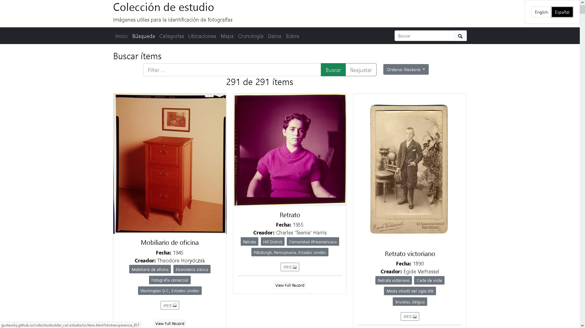

## Navegación de colecciones con Collection Space Navigator (CSN)

[CollectionBuilder](https://collectionbuilder.github.io/cb-docs/) (CB) es un conjunto de herramientas de código abierto para crear sitios web de colecciones digitales y exhibiciones, permite mostrar objetos digitales como imagenes, videos, audios y pdfs, hacer búsquedas y filtrarlos por diferentes criterios, visualizarlos en un mapa, en una linea del tiempo y exportar sus metadatos en diferentes formatos de texto plano.

El proyecto esta dirigidos a investigadores, estudiantes y archivos pequeños que no cuentan con la infraestructura tecnologica o conocimientos avanzados en programación o diseño web, o que reuieren una solución rápida y sencilla para publicar sus colecciones digitales en la web.

<!--more-->

## Resultado

Collection builder tiene tres versiones que se diferencian por su complejidad y capacidades, las he probado con la misma coleccion de objetos digitales para comparar sus resultados, faclidad de uso y capacidad de personalizacion.

La versión más sencilla es [CollectionBuilder Sheets](https://gustavolsj.github.io/collectionbuilder-sheets-demo/), que permite crear una colecciones digital en linea en unos minutos, partiendo simplemente de una hoja de calculo de Google Sheets. Esta pensado para servir como un demo en talleres introductorios que permitan xonocetr y experimentar con la herramienta y posteriormente migrar a alguna de las otras versiones.

La segunda versión es [CollectionBuilder GH](https://github.com/gustavolsj/collectionbuilder_col-estudio/), que permite crear colecciones digitales a partir de un archivo de metadatos en formato CSV y un repositorio de Github, esta pensado para usuarios que quieran aprender conocimientos básicos de GitHub y Markdown y que buscan tener un mayor control sobre la personalización del sitio web.

La tercera versión es [CollectionBuilder CSV](https://gustavolsj.github.io/collectionbuilder-csv-col-estudio/) que usa jekyll, un generador de sitios web estaticos que permite obtener un conjunto de archivos HTML que se pueden subir a cualquier servidor web, el sitio institucional de una rchivo por ejemplo y obtener un sitio funcional completo. CSV esta pensado para usuarios que ya tienen conocimientos que buscan tener un control total sobre la personalización del sitio web. Esta version es la que se actuzaliza más frecuentemente y tiene más funcionalidades que no se encuentran en las otras dos versiones.

## Funcionamiento

CollectionBuilder se basa en el concepto de [LibStatic](https://lib-static.github.io/about/) que es una metodología de desarrollo que aprovecha las tecnologias web estaticas y las habilidades de los bibliotecarios para crear publiaciones web almacenadas en infraestructura mínima.

Algunos de los principios detrás de este enfoque buscan que sea: abierto, enfocado en los usuarios, sencillo y optimizado para bibliotecas y archivos.

- [Ver todas las aplicaciones](/aplicaciones/)
