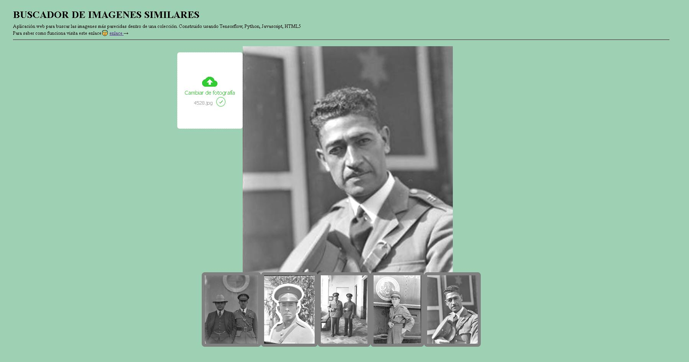

{:width="900"}

## Aplicaciones web

Estas son algunas de las aplicaciones y experimentos que he creado, ya se encuentran en funcionamiento aunque sigo trabajando en ellas para incorporar mejoras en el diseño y la funcionalidad.

### Aplicaciones

- [Buscador de imagenes similares](https://gustavolsj.github.io/web_buscador_img/)
- [Clasificador de imagenes](https://gustavolsj.github.io/clasificador_img/)
- [Teachable Machine, clasificador de imagenes](https://gustavolsj.github.io/teachable_machine/)
- [PixPlot de wikiart](https://gustavolsj.github.io/pixplot_wikiart/)
- [PixPlot de fotografias de VCS](https://gustavolsj.github.io/pixplot_vcs/)
- [Collection Space Navigatigator](https://gustavolsj.github.io/CSN/)
