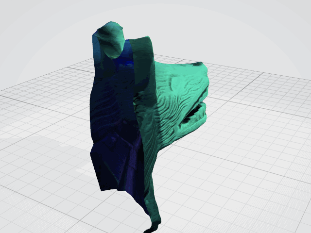

{:width="500"}

## Hacker cultural en formación.

Soy conservador de fotografías y documentos históricos y me interesa la aplicación de técnicas computacionales para el estudio y difusión del patrimonoio cultural. Vivo en la CDMX y trabajo en la UNAM.

### Mis intereses

- IA para la ID de la técnica en fotografías históricas
- Webscrapping y datos abiertos de objetos culturales
- Cultural Analitycs para el análisis de imagenes
- Fotogrametría y modelado 3D de objetos y sitios culturales
- Realidad Aumentada en museos y exposiciones
- Arduino para el monitoreo ambiental y la conservación preventiva
- Processing
